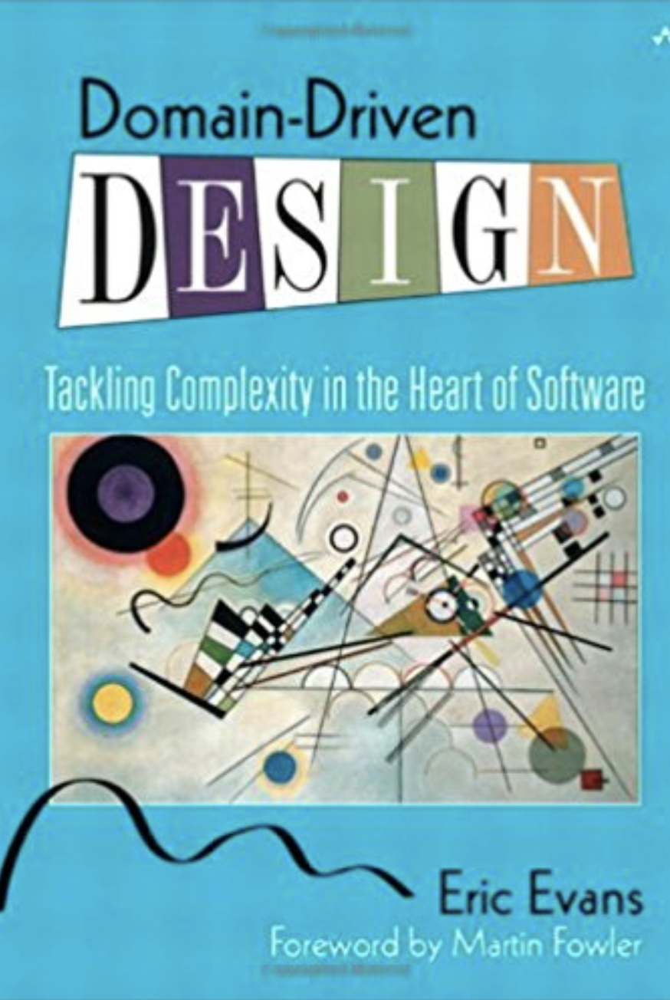
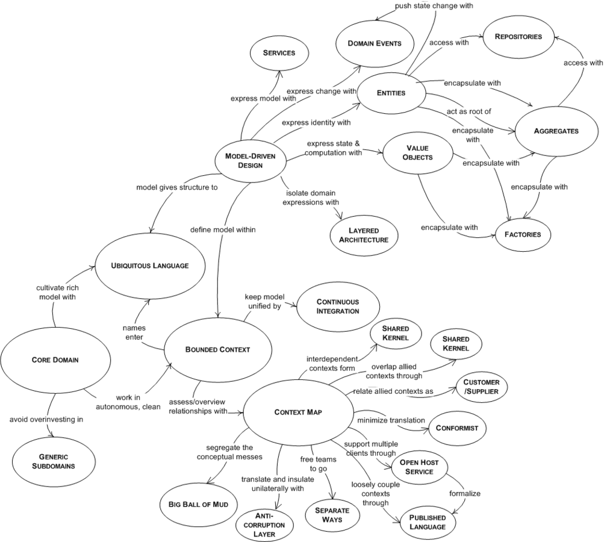
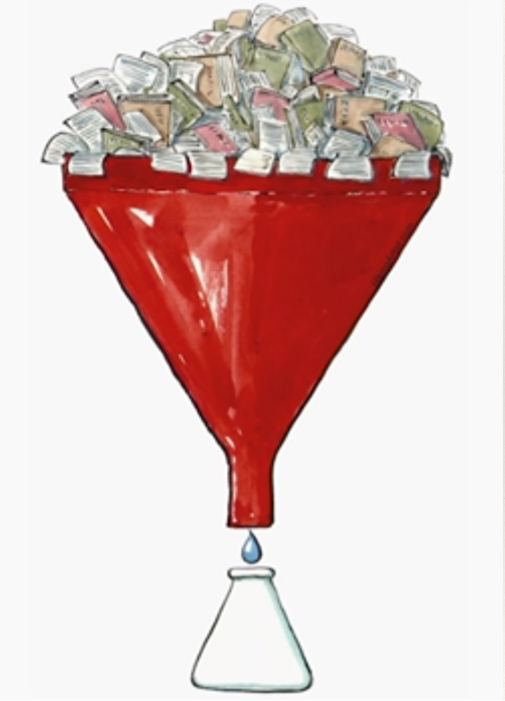
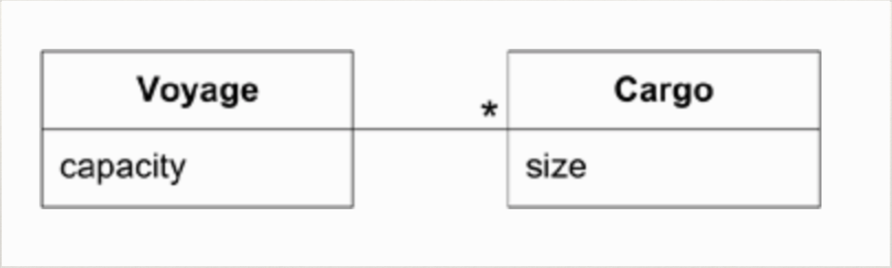
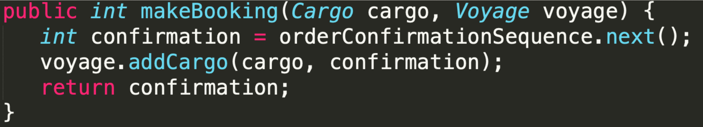
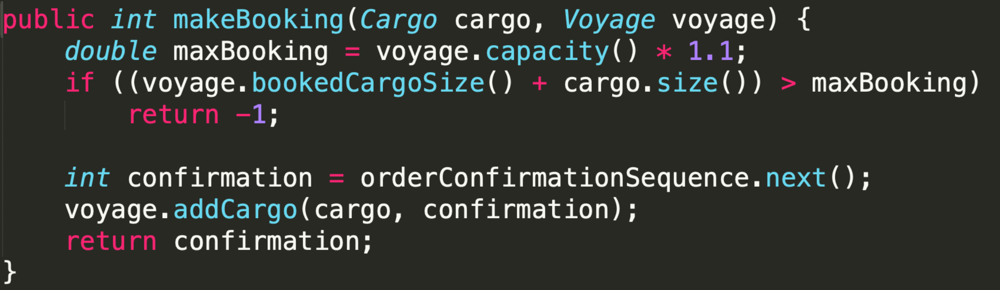
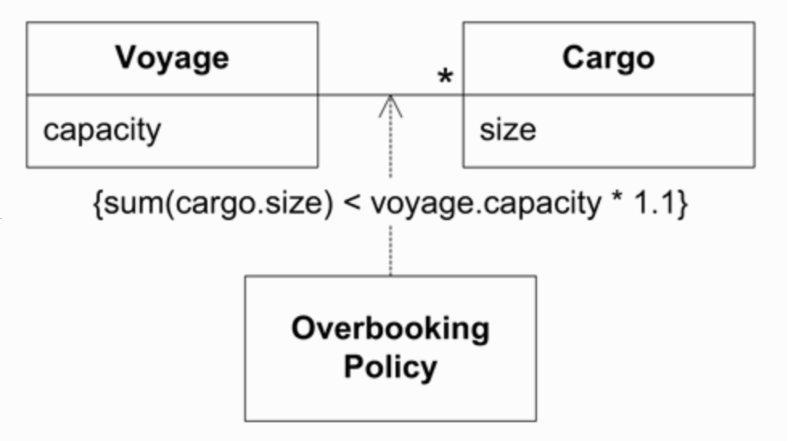
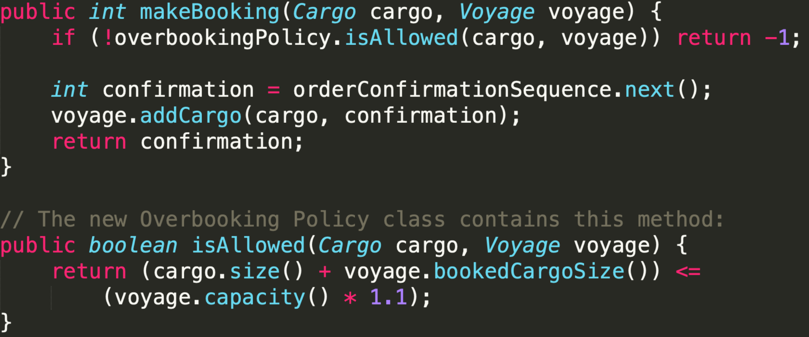
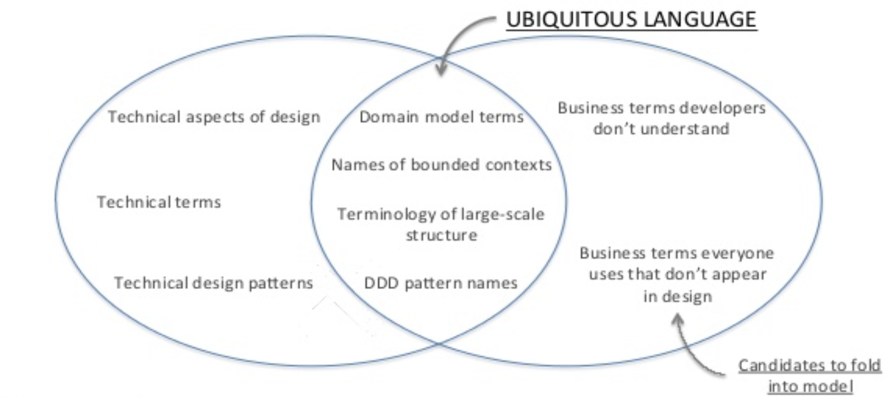
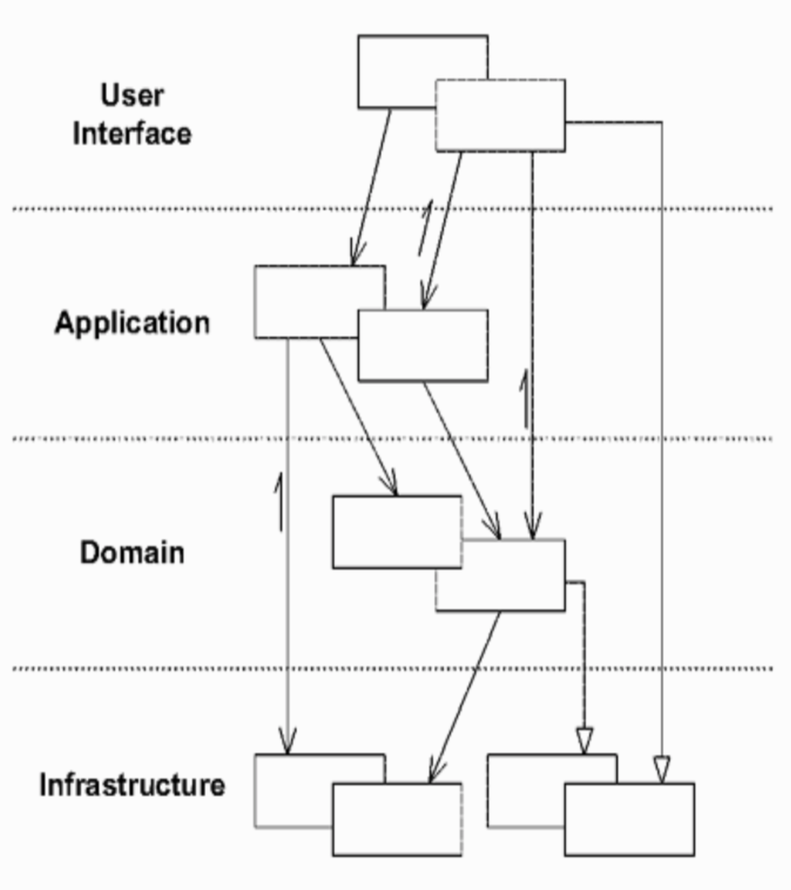

 
 

Introduction to 
Domain-Driven Design  
 

Ganesh Pagade  
March 2019

---

### About Me

- 14+ years in software engineering/architecture <!-- .element: class="fragment" data-fragment-index="1" -->
- Masters in CS from University of Pune <!-- .element: class="fragment" data-fragment-index="2" -->
- 1+ year in Tesco - Transport <!-- .element: class="fragment" data-fragment-index="3" -->
- Interested in Distributed Computing, Microservices, Containers and DevOps <!-- .element: class="fragment" data-fragment-index="4" -->
- <!-- .element: class="fragment" data-fragment-index="5" --> [https://rockoder.github.io/](https://rockoder.github.io/)
- <!-- .element: class="fragment" data-fragment-index="6" --> [https://rockoder.github.io/introduction_to_ddd](https://rockoder.github.io/introduction_to_ddd)

---

### Overview

1. Knowledge Crunching <!-- .element: class="fragment" data-fragment-index="1" -->
1. Ubiquitous Language <!-- .element: class="fragment" data-fragment-index="2" -->
1. Model-Driven Design <!-- .element: class="fragment" data-fragment-index="3" -->
1. Isolating the Domain <!-- .element: class="fragment" data-fragment-index="4" -->
1. Bounded Context <!-- .element: class="fragment" data-fragment-index="5" -->
1. Aggregates <!-- .element: class="fragment" data-fragment-index="6" -->
1. Four Rule of Thumb for Aggregate Design <!-- .element: class="fragment" data-fragment-index="7" -->
1. The Start <!-- .element: class="fragment" data-fragment-index="8" -->
1. References <!-- .element: class="fragment" data-fragment-index="9" -->

---

 
 

Domain-Driven Design  
 <!-- .element: class="fragment" data-fragment-index="1" -->

Eric Evans
 
Addison Wesley. 2003.<!-- .element: class="fragment my-small-font" data-fragment-index="2" -->

---

### Navigation Map

 <!-- .element: class="fragment" data-fragment-index="1" -->

---

### Prerequisites

- Development is iterative <!-- .element: class="fragment" data-fragment-index="1" -->
  
- Developers and domain experts have a close relationship <!-- .element: class="fragment" data-fragment-index="2" -->

---

### The Domain

- Subject area to which the user applies the program. <!-- .element: class="fragment" data-fragment-index="1" -->
  
- Ex: The domain of an airline-booking program involves real people getting on real aircraft. <!-- .element: class="fragment" data-fragment-index="2" -->

---

### The Model

- A model is an interpretation of reality that abstracts the aspects relevant to solving the problem at hand and ignores extraneous detail. <!-- .element: class="fragment" data-fragment-index="1" -->
  
- A model is a selectively simplified and consciously structured form of knowledge. <!-- .element: class="fragment" data-fragment-index="2s" -->

---

### Knowledge Crunching

<ul>
  <li class="my-small-font">Financial analysts crunch numbers. Domain modelers crunch knowledge.</li><!-- .element: class="fragment my-small-font" data-fragment-index="1" -->
  <li class="my-small-font">Raw material:<!-- .element: class="fragment my-small-font" data-fragment-index="2" -->
    <ul>
      <li class="my-small-font">Minds of domain experts</li><!-- .element: class="fragment my-small-font" data-fragment-index="3" -->
      <li class="my-small-font">Users of existing systems</li><!-- .element: class="fragment my-small-font" data-fragment-index="4" -->
      <li class="my-small-font">Prior experience of the team in same domain or related system</li><!-- .element: class="fragment my-small-font" data-fragment-index="5" -->
      <li class="my-small-font">Documents written for the project or used in the business</li><!-- .element: class="fragment my-small-font" data-fragment-index="6" -->
      <li class="my-small-font">Lots and lots of talk</li><!-- .element: class="fragment my-small-font" data-fragment-index="7" -->
    </ul>
  </li>
</ul>

---

### Knowledge Crunching...

<ul>
  <li class="my-small-font">Domain Experts:<!-- .element: class="fragment my-small-font" data-fragment-index="1" -->
    <ul>
      <li class="my-small-font">Not aware of how complex their mental processes are</li><!-- .element: class="fragment my-small-font" data-fragment-index="2" -->
      <li class="my-small-font">They reconcile contradictions</li><!-- .element: class="fragment my-small-font" data-fragment-index="3" -->
      <li class="my-small-font">Fill in gaps with common sense</li><!-- .element: class="fragment my-small-font" data-fragment-index="4" -->
    </ul>
  </li>
  <li class="my-small-font">Software cannot do this</li><!-- .element: class="fragment my-small-font" data-fragment-index="5" -->
  <li class="my-small-font">Knowledge Crunching helps getting the rules clarified, fleshed out, reconciled or placed out of scope</li><!-- .element: class="fragment my-small-font" data-fragment-index="6" -->
</ul>

---

### Knowledge-Rich Design

 <!-- .element: class="fragment" data-fragment-index="1" -->
 
 <!-- .element: class="fragment" data-fragment-index="2" -->

---

### Knowledge-Rich Design...

 <!-- .element: class="fragment" data-fragment-index="1" -->

---

### Knowledge-Rich Design...

 <!-- .element: class="fragment" data-fragment-index="1" -->

---

### Knowledge-Rich Design...

 <!-- .element: class="fragment" data-fragment-index="1" -->

---

### Ubiquitous Language

Ubiquitous Language is a language structured around the domain model and used by all team members to connect all the activities of the team with the software. <!-- .element: class="fragment" data-fragment-index="1" -->

---

### Ubiquitous Language...

 <!-- .element: class="fragment" data-fragment-index="1" -->

---

### Ubiquitous Language...

- A project needs a common language that is more robust than the common denominator <!-- .element: class="fragment" data-fragment-index="1" -->
- Persistent use of ubiquitous language will force the model’s weaknesses into the open <!-- .element: class="fragment" data-fragment-index="2" -->
- Changes to the language will be recognised as changes in the domain model and will lead team to update class diagrams, rename classes or even change the behaviour <!-- .element: class="fragment" data-fragment-index="3" -->

---

### Model-Driven Design

- Tight connection between the model and the code <!-- .element: class="fragment" data-fragment-index="1" -->
- If the managers perceive analysis to be a separate process, the development team may not be given adequate access to domain experts. <!-- .element: class="fragment" data-fragment-index="2" -->
- The modeling and design process to become a single iterative loop. <!-- .element: class="fragment" data-fragment-index="3" -->
- The code becomes an expression of the model, so a change to the code may be a change to the model. <!-- .element: class="fragment" data-fragment-index="4" -->

---

### Model-Driven Design...

- Software development is all design <!-- .element: class="fragment" data-fragment-index="1" -->
- <!-- .element: class="fragment" data-fragment-index="2" --> [What is Software Design?](http://www.bleading-edge.com/Publications/C++Journal/Cpjour2.htm)
  - <!-- .element: class="fragment" data-fragment-index="3" --> A program listing is a document that represents a software design. Compilers and linkers actually build software designs.
  - <!-- .element: class="fragment" data-fragment-index="4" --> Programming is a design activity – a good software design process recognizes this and does not hesitate to code when coding makes sense.

---

### Isolating the Domain

 
<ul>
  <li class="my-small-font">Application Layer<!-- .element: class="fragment my-small-font" data-fragment-index="1" -->
    <ul>
      <li class="my-small-font">This layer is kept thin.</li><!-- .element: class="fragment my-small-font" data-fragment-index="2" -->
      <li class="my-small-font">Does not contain business rules.</li><!-- .element: class="fragment my-small-font" data-fragment-index="3" -->
      <li class="my-small-font">Only coordinates tasks and delegates work to collaborations of domain objects in the next layer.</li><!-- .element: class="fragment my-small-font" data-fragment-index="4" -->
    </ul>
  </li>
</ul>

---

### Isolating the Domain...

 
<ul>
  <li class="my-small-font">Domain Layer<!-- .element: class="fragment my-small-font" data-fragment-index="1" -->
    <ul>
      <li class="my-small-font">This layer is the heart of business software</li><!-- .element: class="fragment my-small-font" data-fragment-index="2" -->
      <li class="my-small-font">Responsible for fundamental business rules</li><!-- .element: class="fragment my-small-font" data-fragment-index="3" -->
      <li class="my-small-font">Domain layer is where the model lives</li><!-- .element: class="fragment my-small-font" data-fragment-index="4" -->
    </ul>
  </li>
</ul>

---
